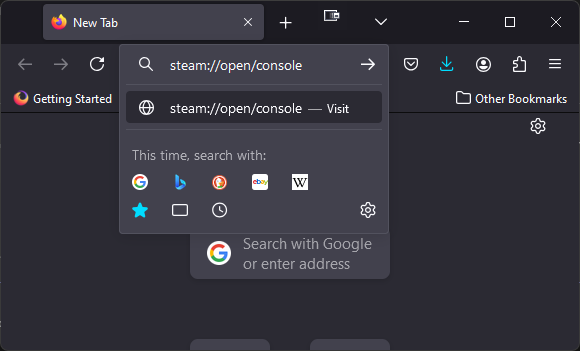
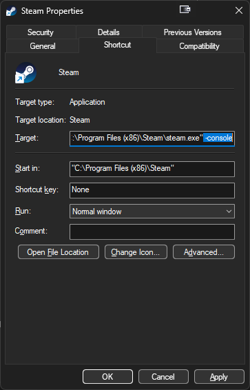
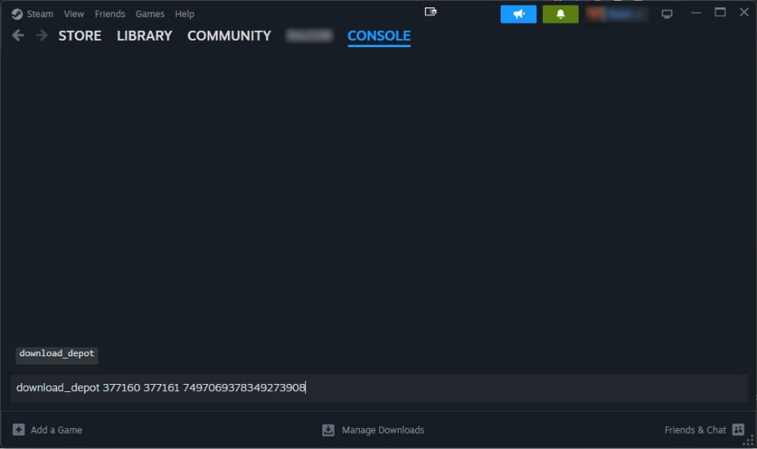
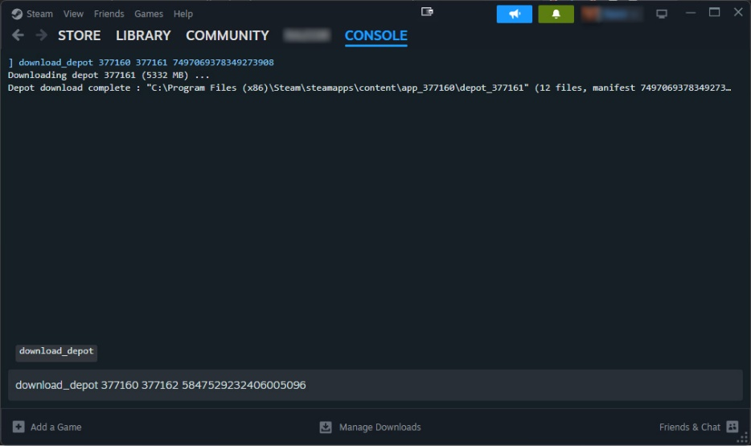
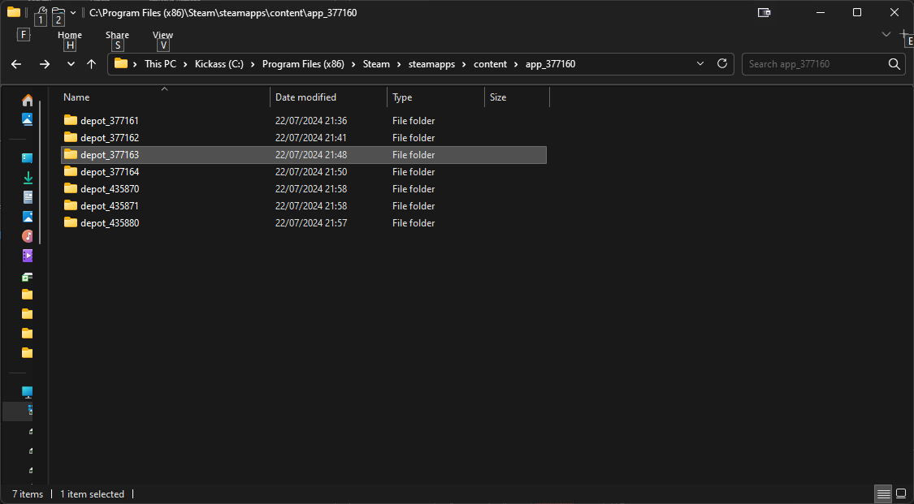
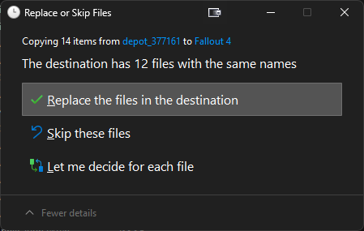
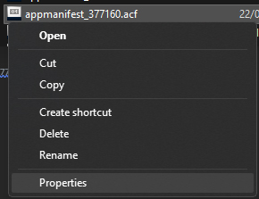
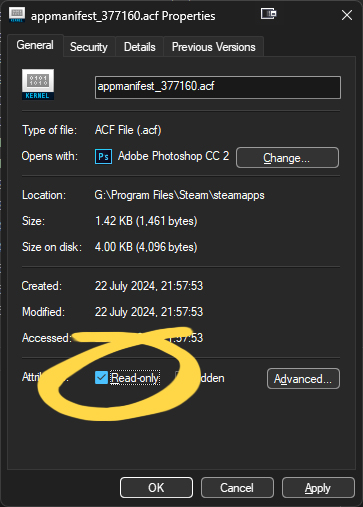
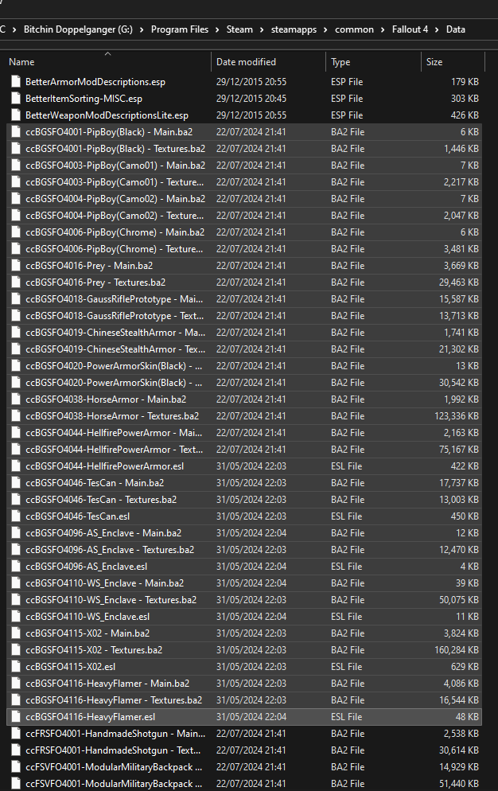

# How to downgrade Fallout 4 manually

Pre-requisites for downgrading:
Fallout 4, Wasteland Workshop DLC, Automatron DLC

First you need to open the Steam Console [via this link](steam://open/console), copy the below and paste it into a web browser or launch Steam with the -console variable
```
steam://open/console
```
<details open>
<summary>Image examples</summary>



</details>

<br>

Then input the following 1 at a time, Steam will notify you once each download is complete, at which point you can move onto the next download:

<details open>
<summary>Image examples</summary>



</details>

<br>

```
download_depot 377160 377161 7497069378349273908
```
```
download_depot 377160 377162 5847529232406005096
```
```
download_depot 377160 377163 5819088023757897745
```
```
download_depot 377160 377164 2178106366609958945
```
```
download_depot 377160 435880 1255562923187931216
```
```
download_depot 377160 435870 1691678129192680960
```
```
download_depot 377160 435871 5106118861901111234
```

After download each depot manually you can move the contents of each subfolder in this directory into your Fallout 4 installation folder, ensuring you overwrite all files in the destination folder

_Note 1: The location of your ‘steamapps/content’ folder may vary if your Steam install isn’t in the default location or you’re using an Operating System other than Windows
Note 2: You can open up your Fallout 4 installation folder easily in Steam by right-clicking on Fallout 4 in your Steam Library and then selecting Manage > Browse Local Files:_

<details open>
<summary>Image examples</summary>



</details>

<br>

```
C:/Program Files (x86)/Steam/steamapps/content/app_377160
```


If you want to block updates you additionally have set the following file to read only

_Note 1: The location of your ‘steamapps/appmanifest_377160.acf’ file may vary if the Steam Library Fallout 4 is installed to isn’t in the default location or you’re using an Operating System other than Windows:_
 
<details open>
<summary>Image examples</summary>



</details>

<br>

```
C:\Program Files (x86)\Steam\steamapps\appmanifest_377160.acf
```

After doing all of this you should remove Creation Club content by removing every file inside 'steamapps/common/Fallout 4/Data' with cc in the start

<details open>
<summary>Image examples</summary>


</details>

<br>