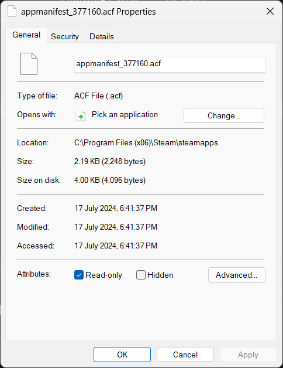

# How to downgrader Fallout 4 manually

First you need to open the Steam Console, [please open this link to do so](steam://open/console)
Or copy this as an argument running Steam.
```
steam://open/console
```

Then input the following 1 at a time:
```
download_depot 377160 377161 7497069378349273908
```

```
download_depot 377160 377162 5847529232406005096
```

```
download_depot 377160 377163 5819088023757897745
```

```
download_depot 377160 377164 2178106366609958945
```

```
download_depot 377160 435880 1255562923187931216
```

```
download_depot 377160 435870 1691678129192680960
```

```
download_depot 377160 435871 5106118861901111234
```

After download each depot manually you can move the contents of each subfolder in this directory

```
C:/Program Files (x86)/Steam/steamapps/content/app_377160
```

if you want to block updates you additionally have set the following file to read only
"C:\Program Files (x86)\Steam\steamapps\appmanifest_377160.acf"
